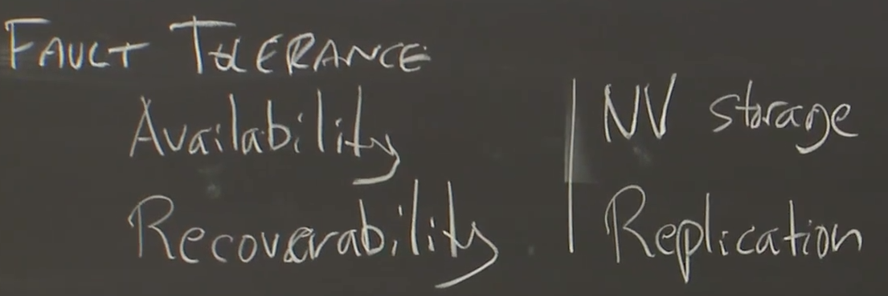
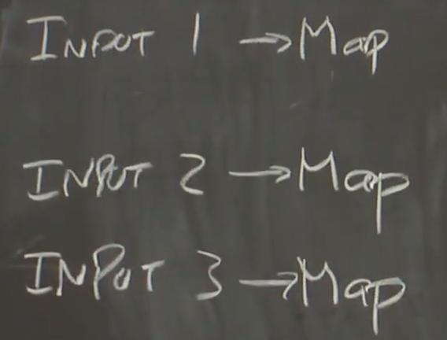
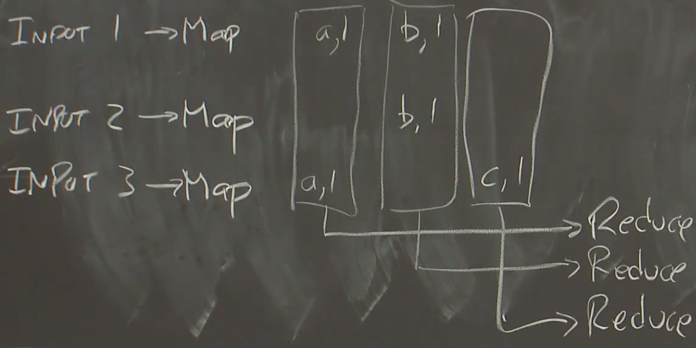
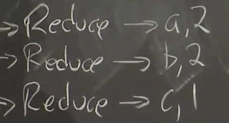
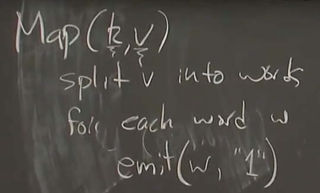
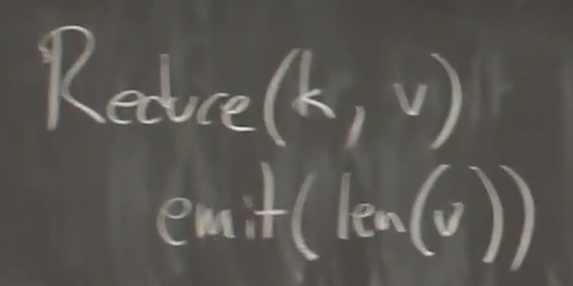

# distributed system

[2020 MIT 6.824 分布式系统_哔哩哔哩_bilibili](https://www.bilibili.com/video/BV1R7411t71W)

之前看过一部分，但笔记做的有限，现在重新跟着再学一下（大致是跟着看到了一部分的class 6，但是真的是挺久以前看的了）

大致class1先讲了分布式系统出现的背景，例如需要更好的表现，更好的容错能力（availability、高可用性，recoverability，持久性？），重建能力。

- topic-consistency
  - pot（k,v)
  - get(k) -> v

传统系统一个server，一个table来检索内容

分布式系统有很多replica来进行备选

强一致性需要更高昂的代价，即当有设备失效我们需要将旧有内容及时清除，以防止client读取到旧的内容

现实世界正在研究有效的弱一致性结构，

---

2021.08.20

在跳过分布式系统出现的背景之后，直接转入**mapreduce思想**的学习过程

by google for TB级的数据分发与处理 他们需要某种架构，让人方便编写相应场景的代码来执行各自的分布式计算。

只要执行简单的函数，整体的计算和原理都交给mapreduce架构来进行处理。

mapfunction只关注输入和输出，输入要处理的数据，输出key，value键值对

分好几阶段，上一阶段就是map。然后进行下一阶段reduce操作

reduce只是用来计算数目的个数，不看其key本身。

且注意到，每一个mapreduce的调用（invocation）都被称为任务。

例如一个map方程的伪代码：k是文件，v是文本

注意同是emit，其中也存在相应的差别

reduce方程：

很多设备尽量都是在同一台物理设备商完成的数据读取与存储过程。

