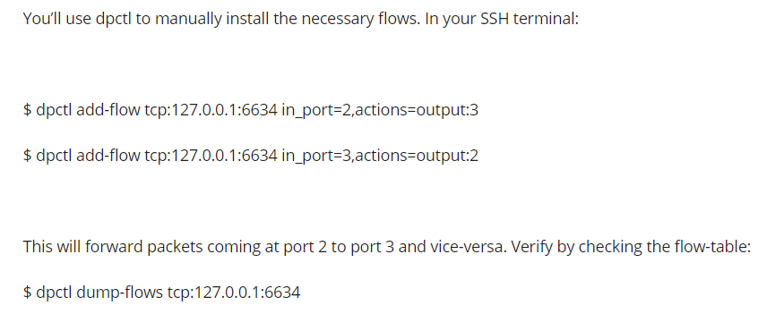
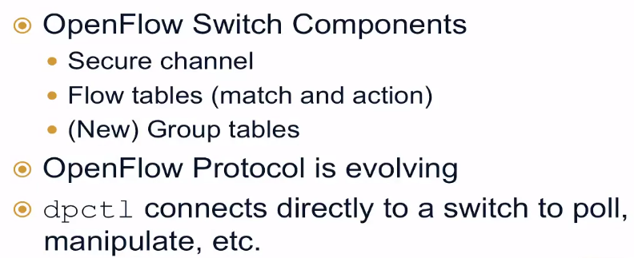
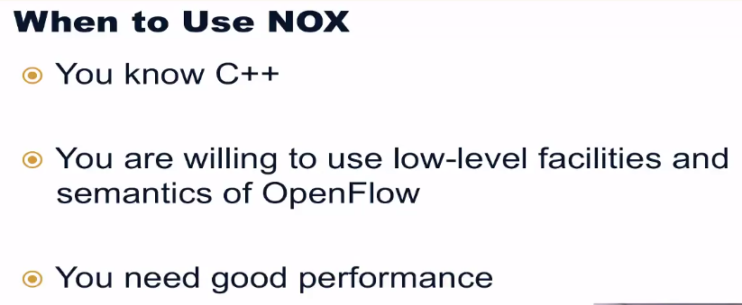
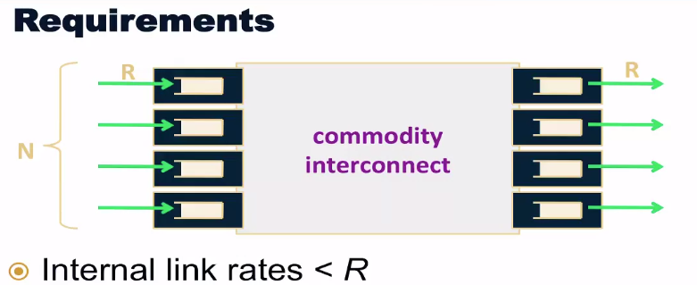
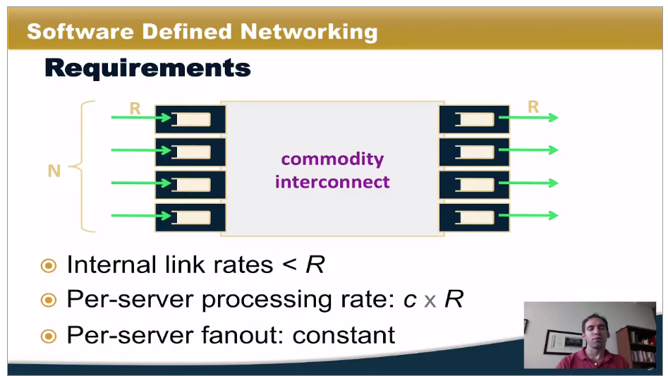

sdn

## mininet tutorial

[Mininet Topologies and Mininet Python API | Coursera](https://www.coursera.org/learn/sdn/lecture/sYg1F/mininet-topologies-and-mininet-python-api)


如果此时退出mn程序，要马上进行一个新的实验


则会提示删除原先的controller，这可能与源代码的控制器保存机制有关。但不影响体验，程序仍然包含了这个相关内容，会自动删除。我们再运行一遍即可。


三个host连接到一个switch上面

---


实际上，mn底层调用的是python函数。

----

在每次运行新的程序时，一定要清楚之前的controller


就像在walkthrough文档中提到的：

[Mininet Walkthrough - Mininet](http://mininet.org/walkthrough/#cleanup)

> sudo mn -c 

这一句指令即可实现目的。


当然，课程中也进行了 较为复杂的内容展示。无非就是调用了更多的api，代码结构采用了对象等使得结构更加简洁的方式来处理。

```PYTHON
#!/usr/bin/python

from mininet.topo import Topo
from mininet.net import Mininet
from mininet.util import dumpNodeConnections
from mininet.log import setLogLevel

class SingleSwitchTopo(Topo):
    "Single Switch connected to n hosts."
    def __init__(self,n=2,**opts):

        # initializae topology and default options
        Topo.__init__(self,**opts)
        switch = self.addSwitch('s1')

        for h in range(n):
            host = self.addHost('h%s'%(h+1))
            self.addLink(host,switch)


def simpleTest():
    #create and test a simple network"
    topo = SingleSwitchTopo(n=4)
    net = Mininet(topo)

    net.start()

    print "Dumping host conections"
    dumpNodeConnections(net.hosts)
    print "Testing network connectivity"
    net.pingAll()
    net.stop()

if __name__=='__main__':
    setLogLevel('info')
    simpleTest()
```


之后的课程会涉及一些本节课没讲到的


---

第二课即开始讲解一些mininet的操作，mininet指令环境，linux环境，sudo权限环境


dpctl指令对debug用处很大，增强一个控制器流表的能见度和控制属性

但是有的节点没法ping通，是要注意到 switch的flow table是空的，在没有建立映射关系前，OFS也不知道怎么传输数据。

---

dpctl: failed to send packet to switch: Connection refused

这个是在跟随课程实验时遇到的问题


192.168.31.176


跟着coursera的课有bug，试着跟着官方文档。 

如果还有错误，就重新下载镜像处理


xterm能用了，解决方式就是下载了一个开源的软件xming，起到一个位linux服务器终端开通GUI界面的途径

[ssh - Ubuntu Windows10 App -- X11 Forwarding -- $DISPLAY Error - Unix & Linux Stack Exchange](https://unix.stackexchange.com/questions/427574/ubuntu-windows10-app-x11-forwarding-display-error#comment1213744_489406)

[Xming X Server 配置和使用_小宋的博客-CSDN博客_xming使用](https://blog.csdn.net/qq_39101111/article/details/78727355)


图形化显示问题解决了，但是

dpctl这几个需要访问端口的操作仍然是失败的


wireshark无法启动也是一个问题

[Problems attaching over X11 and Xming (kinetic) · Issue #9 · ros-visualization/rqt_image_view (github.com)](https://github.com/ros-visualization/rqt_image_view/issues/9)

这里提到了，可能由于xming是一个老工具

现在用一个新的工具试试

[VcXsrv Windows X Server download | SourceForge.net](https://sourceforge.net/projects/vcxsrv/)


确实，更新软件之后，这里就可行了。

而且也确实发现这个软件2021年还在维护

[Mininet Walkthrough - Mininet](http://mininet.org/walkthrough/#cleanup)

继续跟着workthrough中进行操作

注意到：Note that *only* the network is virtualized; each host process sees the same set of processes and directories. For example, print the process list from a host process:

用ps打印指令，发现host都能了解network已经执行了什么操作


在启动mn程序时，加上--mac字段，能让设备初始化的地址尽可能的小和有序，方便debug

巧妙利用xterm的存在


在交换机上配置指令，

然后在其他host上执行操作，如ping，以起到影响flow table的效果


---

有一点注意，coursera课程中的端口127.0.0.1:6634是在他们的环境上

 

本机提示的虽然在6653上创建端口，但我这边就要后备端口6654，原因可能可以借鉴下方


当启用远程remote controller来运行程序时

 h2 ping -c3 h3

这种ping的操作可能无法执行，因为

> As you saw before, switch flow table is empty. Besides that, there is no controller connected to the switch and therefore the switch doesn’t know what to do with incoming traffic, leading to ping failure.

解决方案：

注意，端口号在本机上改为6654


但直接这么设置，返回另一个cli是不成功的，原来是这种dump-flows是有时效性的

> Do you get replies now? Check the flow-table again and look the statistics for each flow entry. Is this what you expected to see based on the ping traffic? NOTE: if you didn’t see any ping replies coming through, it might be the case that the flow-entries expired before you start your ping test. When you do a ”dpctl dump-flows” you can see an ”idle timeout” option for each entry. This means that the flow will expire after this many secs if there is no incoming traffic. Run again respecting this limit, or install a flow-entry with longer timeout.


之前两条装载指令加上idle时限即可


---

**一些关键术语**：

OpenFlow Interface: a standard open interface between the OpenFlow controller and the OpenFlow programmable devices (i.e., switches etc)

OpenFlow Controller: sits above the OpenFlow interface. The OpenFlow reference distribution includes a controller that acts as an Ethernet learning switch in combination with an OpenFlow switch. You'll run it and look at messages being sent.

OpenFlow Switch: sits below the OpenFlow interface. The OpenFlow reference distribution includes a user-space software switch. Open vSwitch is another software but kernel-based switch, while there is a number of hardware switches available from Broadcom (Stanford Indigo release), HP, NEC, and others.

dpctl: command-line utility that sends quick OpenFlow messages, useful for viewing switch port and flow stats, plus manually inserting flow entries.

Wireshark: general (non-OF-specific) graphical utility for viewing packets. The OpenFlow reference distribution includes a Wireshark dissector, which parses OpenFlow messages sent to the OpenFlow default port (6633) in a conveniently readable way.

iperf: general command-line utility for testing the speed of a single TCP connection.

Mininet: network emulation platform. Mininet creates a virtual OpenFlow network - controller, switches, hosts, and links - on a single real or virtual machine. More Mininet details can be found at the Mininet web page .

cbench: utility for testing the flow setup rate of OpenFlow controllers.

---

OpenFlow 接口：OpenFlow 控制器和 OpenFlow 可编程设备（即交换机等）之间的标准开放接口 

OpenFlow 控制器：位于 OpenFlow 接口之上。 OpenFlow 参考分布包括一个控制器，该控制器与 OpenFlow 交换机结合用作以太网学习交换机。 您将运行它并查看正在发送的消息。

OpenFlow 交换机：位于 OpenFlow 接口下方。 OpenFlow 参考分布包括用户空间软件交换机。 

Open vSwitch 是另一种基于内核的软件交换机，而 Broadcom（Stanford Indigo 版本）、HP、NEC 和其他公司提供了许多硬件交换机。

dpctl：发送快速 OpenFlow 消息的命令行实用程序，可用于查看交换机端口和流统计信息，以及手动插入流条目。

Wireshark：用于查看数据包的通用（非 OF 特定）图形实用程序。 OpenFlow 参考分布包括一个 Wireshark 解析器，它以一种方便可读的方式解析发送到 OpenFlow 默认端口 (6633) 的 OpenFlow 消息。

iperf：用于测试单个 TCP 连接速度的通用命令行实用程序。

Mininet：网络仿真平台。 Mininet 在单个真实或虚拟机上创建虚拟 OpenFlow 网络——控制器、交换机、主机和链接。 更多 Mininet 详细信息可以在 Mininet 网页上找到。

cbench：用于测试 OpenFlow 控制器的流设置速率的实用程序。

---

继续学习新的课程

overview

- what is control/data seperation
- why it's a good idea
- 机会和挑战都是什么

在多种领域的机会

- 路由，数据中心等

挑战和方法

- scaling，reliability


### control and data planes

#### control plane

logic for controlling forwading behavior，控制转发行为的存在，类似于控制人类整体的大脑。实际例子包含：- 路由协议，- network middlebox configuration

#### data plane

forward traffic 即实际上执行转发流量的操作，其根据的规则是来自控制平面

其实际例子包括ip转发层，被创建的路由表。通常它的代表设备是硬件，但是现在越来越多的被以软件的方式实现


为什么要分离：

1. independent evolution and development

   软件对网络的控制与硬件的限制分离

2. control from high-level software program

   更容易推理网络行为，也更容易debug

---

### Opportunities in various Domains

维护，egress selection security 很有帮助，方便我们对架构进行升级，容错性也高

#### Interdomain routing: constrained policies

之前的背景：


有了SDN：route controller can directly update state 不需要再走那些步骤和流程，利用控制器的存在直接更新整个网络的情况。

---

dry out

egress selection

​	不用再为每个出口单独部署流量出规则，直接由控制屏幕中央控制即可

better bgp security

上面的内容都或多或少借助了RCP的作用，但是由于都是指定prefix进行传播，导致网络对流量的理解十分有限，能提供的动作也十分有限了。

data centers


layer 2让问题变成了topology specific而不是topology dependent


readdress the host，so we can use the mac 


---

### challenges in seperating the data and control planes


SOLVING approaches: RCP,ONIX

> 查询一下RCP的资料，之前忘记整理
>
> [BGP-based Routing Control Platform (RCP) (network-insight.net)](https://network-insight.net/2015/11/bgp-based-routing-control-platform-rcp/)
>
> The Routing Control Platform (RCP) is a centralized forwarding solution enabling the collection of a network topology map, running an algorithm and selecting preferred BGP route for each router in an Autonomous System (AS). RCP是一种中心化的转发方案，使得运行网络拓扑映射的集合通过运行算法来为每个在AS中的路由器选取适合的BGP路由
>
> It does this by peering both IGP and iBGP to neighboring routers and communicates the preferred routes using *unmodified iBGP*. 它（算法）通过与邻居路由器建立IGP以及iBGP对等体，并利用无修改的iBGP来交换各自prefer的路由
>
> It acts similar to that of an enhanced route reflector and does not sit in the data path.  它的行为像是一个路由反射器，但是并不出现在数据路径当中
>
> 

所以下面，以RCP为例子，探讨一下所出现的问题


把动态成本化为静态，存储下来即可。（但这样同样会有设备达到其限制）


第二点，reliability for RCP

- replicate RCPs("Hot Spare热备")
  - run multiple identical servers
- run independent replicas
  - each replica has its own feed of routes
  - each replica receives the same inputs and runs the same routing algorithm
  - no need for a consistency protocol if both replicas always see the same information


可能没法保证一致性，因为考虑的内容不太相同。


上述三大挑战是很关键的。

----

这个课后测试头皮发麻，


	


---

### routing Control Platform


一些BGP面临的问题


路由器之间是某种情况下独立的，没有任何路由器具有整个网络完整的BGP状态


政策总是在每个网络局部被分袂，所以要找到一个代表统一网络范围政策是相当困难的

路由本身必须携带状态，但上图这种分解让过程relatively difficult。

所以，

#### 引入RCP是有好处的


有了RCP的控制，路由器本身不必使用状态路由标记，在配置上也简单多了


且原始状况下，BGP会以意想不到的方式与底层进行交互，例如考虑IGP权重，会让host之间流量转发产生环路


但例如RCP，会学习所有外部路由，具有完整路由信息。避免的内部环路


但面临的问题就是，在所有设备已经运行IGP 相互做出独立决策的情况下由RCP来指定转发行为

#### control protocal interactions


设置固定点，即使区域内部某点故障了，通过RCP的设定，仍能保持egress出口不出错

第二阶段


不仅了解最佳路由，也要了解其他路由情况，所以知道的信息更加全面


之前的BGP操作默认进行了路由汇总，但是路由器不知道哪些路由器需要更加具体的路由，以保证准确性


第三


总结：


### video the4d network architecture


这里面的control plane和前几节提到的也有不同，主要讲的还是路由协议，跟踪拓扑的变化，计算路由，转发表等，并不会做其他更复杂的事情（比如实现网络范围内的管理调用）。

所以4D network的出现是来应对这种情况


大量功能转入软件实现，消除了对网络供应商的依赖，加速了网络管理的创新


#### 4d网络的终极目标


实现网络级别的配置，而不是仅停留在路由器设备商，**最大限度减少整个网络的链路利用率**? 


---


4d模型的关键在于好的抽象，减少了问题的复杂性


在这里，决策层可以同时看到流量工程与访问控制，所以在这里也可以执行负载均衡


该论文还是期待消除控制平面的存在，但是SDN并未这样

总结：


》quiz 我承认，做题让人头皮发麻了。 做了30%，先继续往下看本节课程

---

[David Clark Interview | Coursera](https://www.coursera.org/learn/sdn/lecture/KoZho/david-clark-interview)

专题 访谈1 

SDN 的role 以及之后的作用

1. 数据平面和控制平面分离。 而互联网原始架构中，考虑过分离吗？ 之前考虑过但是没用：基于一种哲学，我们需要可靠，所以我们向电脑妥协。不能基于第三方，让两个pc无法交互（例如dhcp服务器的崩坏让通信无法进行）在技术发展初期，很少有公司能把这个技术发展都发展好。

虽然我们没能限制BGP在全局上的收敛速度，它明显比我们预计的时间要长。但是这些动态协议确实维持了很好的功能性

当我们没有好的工具去控制网络延迟，我们需要新的网络

我们无法在网络上得到鲁棒性的方案，可能是我们将流量路径过度具象化了

sdn魔种程度上坚挺了边界的划分（ip layer 和 layer two）

---

另一个访谈就先跳过了。


## week 3 module3：the control plane

- key terms:
  - openflow specification
  - flow table caching: 流表结果缓存在交换机中的过程，用来防止所有的数据包都要经过控制器转发
  - control channel：SDN控制器用来与SDN-capable的交换机交流的信道
  - controller overhead: 控制器接管？指的是当交换机没有某个数据包的对应流表转发项而将该包发送到控制器处理的过程。
  - openstack：云操作系统，利用网络虚拟化技术和openflow去展示资源的logical pool的抽象

列举了一系列openflow的项目列表：

[List of OpenFlow Software Projects (stanford.edu)](http://yuba.stanford.edu/~casado/of-sw.html)

---

### the control plane


基础知识about openflow：


控制信道的目的主要是为了更新流表，

protocol specification 规定了两个交换机组件：

第一是flow table


交换机行为都取决于flow table中的表项

第二是secure channel：


它决定了交换机与外部控制器的通信方式

 openflow1.0


避免了过多流量在控制器拥塞


当然openfflow switch也可以表现普通


dpctl指令允许我们与switch进行交互，查看流表条目，修改流表条目等


例如展示信息如上。

我们可以用dump-flows指令来展示流表的装载情况


如果装载条目为空，我们可以利用add-flow指令来增加，但是记得要把反向接口也加入其中，

1.3版本引入了很多概念，action set和group


这边也有一些可选项


总结：



poll 轮询

### overview of sdn controller

大纲：


对控制器的选择有很多考量

- 编程语言，这通常影响了性能
- 学习曲线，即学习成本
- 使用人员的基础以及相应的社区支持
- 重点：
  - 南向接口数量
  - 北向接口（policy layer，如何能与应用层对接）
  - 对openstack的支持
  - 用于的场景，教育研究还是生产




pox：


简单的学习曲线，我们选择这个为例子


ryu：


floodlight：


但是学习曲线还是相对较高的

opendaylight：


summary：


---

### customizing SDN control(part 1 : switching)


自定义switch的行为

回顾集线器和交换器

利用pox交换机和mininet的拓扑结构

实现两种不同的控制


根据转发条目来学习路由

利用dpctl来查看流表。

code walkthrough

实例1topo：


执行上述操作完毕后，但实际上还并未实例化控制器。实例先尝试pingall操作


先了解一下hub


它不存储信息，它直接将接收的流量进行发送。

这一节所用的实例代码：

[pox/hub.py at carp · noxrepo/pox (github.com)](https://github.com/noxrepo/pox/blob/carp/pox/forwarding/hub.py)

```python
# Copyright 2012 James McCauley
#
# Licensed under the Apache License, Version 2.0 (the "License");
# you may not use this file except in compliance with the License.
# You may obtain a copy of the License at:
#
#     http://www.apache.org/licenses/LICENSE-2.0
#
# Unless required by applicable law or agreed to in writing, software
# distributed under the License is distributed on an "AS IS" BASIS,
# WITHOUT WARRANTIES OR CONDITIONS OF ANY KIND, either express or implied.
# See the License for the specific language governing permissions and
# limitations under the License.

"""
Turns your complex OpenFlow switches into stupid hubs.
"""

from pox.core import core
import pox.openflow.libopenflow_01 as of
from pox.lib.util import dpidToStr

log = core.getLogger()


def _handle_ConnectionUp (event):
  msg = of.ofp_flow_mod()
  msg.actions.append(of.ofp_action_output(port = of.OFPP_FLOOD))
  event.connection.send(msg)
#得到消息后创建消息，然后再反馈回switch
  log.info("Hubifying %s", dpidToStr(event.dpid))

def launch ():
  core.openflow.addListenerByName("ConnectionUp", _handle_ConnectionUp)

  log.info("Hub running.")
```

但是仅仅用pip install指令的pox 好像没法像这个实例一样导入core

[Installing POX — POX Manual Current documentation (noxrepo.github.io)](https://noxrepo.github.io/pox-doc/html/)

查看pox的安装文档


本实验出的结果与展示的并不一致


---


20200820的笔记出现重大失误，左手倒右手的复制粘贴弄错了，算是吃了个教训

[Slicing Network Control | Coursera](https://www.coursera.org/learn/sdn/lecture/uqxgO/slicing-network-control) 当天的笔记学习到这里


其中也记录了几个文档的出处，整理了北向接口和南向接口的大概。

包括pox的使用实例，在l2_learning的基础上写了个l2_firewall，这说明在pox的扩展性很强，写几句额外代码就可以通过switch为二层设备增添规则

大概是学了控制平面，网络虚拟化，和一些技术，主要还是pox和mininet的介绍。继续加油吧。

总之看了一遍肯定是不够，继续往下看吧，暑假的任务是过一遍，回过头来再继续补

---

20210821

继续学习

## week 4

### slicing network control

大纲：


虚拟机化sdn控制器，让他们互不影响

传统的sdn架构：


slicing：


切片之间是强制隔离的，slice也有自己的policis定义


每个切片的能力都没有被阉割，都能执行转发控制等操作。

why 为什么使用切片


你要管理分组的时候

多用户的时候，你要将现成物力资源有效划分（有虚拟化的思想在里面）


注意，并不会影响性能表现，策略制定了每个切片可用的资源配比

flow space技术：


实施隔离的一个方法是没有两个控制器控制同一部分流空间

#### flowvisor，一个openflow控制器：


注意，每个切片都是1-4层间任意字段的组合上定义


该控制器位于部分控制器之间，执行一些规则检查

其他对网络切片的方法：


通过对端口划分，例如VLANs的技术思路，也可以通过应用方式，例如tcp端口


一大应用，对网络进行测试，让操作员用来评估性能，迁移到实际场景当中


将用户根据功能进行分组，来实现不同的目的，提供不同质量的服务。

summary总结:


确实VLANs技术已经对网络进行虚拟化处理，但是切片SDN控制提供了更多的可能性，使得切片网络可以在多个实体之间共享网络

### virtualization in multi-tenant datacenters

[Virtualization in Multi-Tenant Datacenters | Coursera](https://www.coursera.org/learn/sdn/lecture/bNPBg/virtualization-in-multi-tenant-datacenters)

大纲：


#### multi-tenant datacenter


是单个物理数据中心，但其是由许多租户共享的。

挑战有很多，其中包括了不同类型的应用，流量，负载需要配备不同的网络拓扑与相应服务。且不可忽视物理网络的编制会与虚拟网络分配的地址空间有重叠，其中的技术细节也同样需要考虑


网络虚拟管理程序应该具备，让数据包觉得自己就在原生环境当中


nvp overview


控制器通过解耦合操作逻辑来进行规模化扩展，即分成逻辑控制器与物理控制器，分别负责不同的操作


要区分sdn和网络虚拟化，他俩是两个概念

通常会有一些误解发生。

注意网络虚拟化但是较早，且其完全不需要SDN技术。早于SDN的网络虚拟化包括vlans，网络覆盖等。但是不能忽略SDN的价值，例如其使得协调多租户数据中心变得更加轻松。因为与物理交换机相比，SDN交换机虚拟化容易的多。网络虚拟化可以为每个虚拟网络于运行单独的控制器。

且DN使得对所有流量进行分区变得简单。

summary：


---

quiz：

[Quiz 4.2: Data-Center Virtualization | Coursera](https://www.coursera.org/learn/sdn/exam/jL96g/quiz-4-2-data-center-virtualization/attempt?redirectToCover=true)

这个quiz能做到50分，已经很惊人了

做一个小归纳

- something true about "network slicing"
  - network operators can use slicing to test configurations on "shadow" networks that mirror a production network topology
  - one way to slice networks is according to "flow space", whereby different controolers might control distinct and non-overlapping traffic flows
  - Multi-tenant datacenters are one use case for network slicing.
- something true about flow space
  - One host could send traffic that ends up in two different flow spaces
- Which of the following describe the control-plane checks that FlowVisor implements?
  - Flowvisor prevents a controller from writing data-plane rules to a part of flowspace that it does not own.
  - When a packet must be forwarded to a controller, Flowvisor forwards traffic to the correct controller based on which controller “owns” the flowspace corresponding to that packet. 
- What best describes the relationship between network virtualization and SDN?
  - SDN controllers can help manage storage and data facilities, in addition to network configuration
  - SDN makes some aspects of network virtualization easier to manage

我选的是简版课程，没有做过assignment，所以有三道题是绝对不知道的。

---

#### network functions virtualization socalled NFV

这个应该是网络虚拟化的一部分，或现在主要研究的内容，但据说表现效果并不太好

[Network Functions Virtualization | Coursera](https://www.coursera.org/learn/sdn/lecture/NgsBU/network-functions-virtualization)

什么事NFV


现状：


传统的结构里面有很多这种middlebox

而NFV的架构做了简化，其将这些middlebox做了统一整理，然后在网络中分配这些功能


由于这些功能与托管他们的硬件已经分离，操作员执行数据包处理方式上获得更大的灵活性

benefits：


新使用案例：


使用它的好处，能够在更精细的粒度上提供服务


以上是传统middlebox的形式，都是通过单独细小的模块功能组合实现的。而NFV的观点就是**将元素放在虚拟容器当中**，而不是依次部署整体中间middlebox

一些challenges挑战：

orchestration编排，customization自定义


slick方法，允许程序员定义 elements，来重用函数


---

tips内容补充，port 80：

[What is Port 80? - Definition from Techopedia](https://www.techopedia.com/definition/15709/port-80#:~:text=Port 80 is the port,receive HTML pages or data.)

80端口很重要，被用来分配去进行网络交流的端口号，HTTP协议就要用这个端口。也是TCP需要用到的端口。

[The importance of Port 80. Just what is Port 80? | by Odyuzaki | Medium](https://medium.com/@odyuzaki/the-importance-of-port-80-243e5953cbd9)

---


根据流量配比，来分配元素的位置


NFV future work：


summary总结：


---

### docker and containerization

[Docker and Containerization | Coursera](https://www.coursera.org/learn/sdn/lecture/oyA43/docker-and-containerization)


mininet就是一种形式，将容器与虚拟隧道连接来模拟网络

#### containers：


why userful：


允许软件某种意义上拥有整个实际环境。

#### docker和虚拟机的区分：


容器比虚拟机更轻量化，加载速度更快。


容器的开销耕地，直接操作系统调用，而不是模拟操作系统，且提供了很多比虚拟机更容易的备份和更简单的缓存行为

应用场景：


实例：


可以直接在服务器上调用docker run指令，如果本地没有，他会自动pull一个内容，并装载到本地


且可以通过docker images指令来进行镜像的查看


这个课程讲解的时候，把这些内容都叫做container，可能有老师自己的考量吧？测试


这里提到了一个守护进程的概念

>守护进程（daemon）是生存期长的一种进程，没有控制终端。它们常常在系统引导装入时启动，仅在系统关闭时才终止。

[守护进程 - 搜索结果 - 知乎 (zhihu.com)](https://www.zhihu.com/search?type=content&q=守护进程)


summary:


一种轻量的部署方法。

### networking in Docker

[Networking in Docker | Coursera](https://www.coursera.org/learn/sdn/lecture/QWcmg/networking-in-docker)


利用docker来建立网络


默认情况下，简历的两个docker是完全隔离的

如果哦通信，则需要建立bridge

根据教程：


再安装一个名为install的测试环境


通过attach进入镜像，然后再安装apache服务器

但是centos上安装ubuntudocker老有问题


我更改个名字，换个docker镜像试试

[解决docker镜像（centos系统）中无sudo命令_liuwei0376的专栏-CSDN博客](https://blog.csdn.net/liuwei0376/article/details/89638228)


同时根据分享，安装一下sudo服务


这部分学习确实仓促了


summary:

这节的实例，可以去实操一下，很有意思。在docker中运行两个镜像，互相通过端口进行交互。


---

interview3:


----

## week 5 five：the data plane

### Learning Objectives

- Describe why programmable data planes are needed.
- Discuss the limitations of OpenFlow and how programmable data planes can address some of these limitations.
- Appreciate some of the design decisions associated with programmable data planes.
- Compare the tradeoffs between hardware and software programmable data planes (i.e., flexibility vs. performance).

---

这一节的内容相对独立，数据平面中引入了新的技术。

key terms关键词：

- FPGA 可编程硬件：stands for Field Programmable Gate Arrays, is a reconfigurable circuit that allows designers and customers to program it using hardware description language (HDL) like Verilog or VHDL. 
- NetFPGA：A circuit board, with four network interfaces and an FPGA, built at Stanford University as an open-source platform for research and classroom experimentation.
- TCAM：stands for Ternary Content Addressable Memory, is a high speed memory used to store flow table entries in the IP/OpenFlow switches and routers.》代表着在openflow交换机和路由器中用来存储流表项的高速存储
- LPM： stands for Longest Prefix Match, is an algorithm in computer networking used to select an entry from a routing table of an IP router.》IP路由器常用的最长前缀匹配算法

---

### programmable data planes

[Programmable Data Planes | Coursera](https://www.coursera.org/learn/sdn/lecture/LPQrK/programmable-data-planes)

大纲：


这允许操作员自定义数据平面相关的操作

传统数据平面的外观：


首先会接收数据包，查询其header中的内容，查询本地转发表，锁定下一跳内容。除了执行查找，匹配等简单动作，如果我们想进行其他操作，则需要在数据平面中进行额外的定义

我们期待的功能表现dataplane：（毕竟主要与flow table交互好则可实现）


SDN的软件思想为自定义数据平面供可能

现有背景：网络设备多样，但是修改这些现有设备可能非常困难（因为他们这些功能是基于硬件的）


#### click a software data plane


每个click元素提供唯一的功能


注意到这些函数功能是可以进行复合的，只需要将模块合理编排即可


summary总结：

两种平面都是可编程的


click提供的性能对于原型设计来说仍然是可接受的

### making software faster: routeBricks

[Making Software Faster: RouteBricks | Coursera](https://www.coursera.org/learn/sdn/lecture/LImYQ/making-software-faster-routebricks)

outline:


我们期望使用软件，是想利用他们的可编程性、灵活性和可扩展性。

但是硬件的高转发速率仍然也想有

两种技术路线来实现这个目标 一个是试图让软件解决方案性能更好，另一种方案是使得硬件可编程。

#### motivation：


现有工具：


服务器每秒处理r位





所以，使用一组服务器来设计一个可编程数据平面是具有很多挑战的：


解决方法approach：

- strawman approach


- valiant load balance


这样满足了出口小于带宽要求的限制以符合商用设备的条件。中间因为要随机中转流量，对设备的处理速率有了要求。

对服务器集群的设计完成之后，也要考量到单个服务器的表现，也不能差


为了提高包处理效率，采用批处理的方案


这两个分配核心的机制可以参考


summary总结：


### programmable hardware overview


control plane的演进很快，但是数据平面的发展很慢


#### programmable chipsets：RMT

[Programmable Chipsets: RMT | Coursera](https://www.coursera.org/learn/sdn/lecture/1sk09/programmable-chipsets-rmt)

我们从SDN期待的是什么

- protocol-independent processing 处理流量，独立于任何协议
- conrol and repurpose in the field 调整网络行为并在现场调整网络设备的用途，且无需重新部署硬件
- Implemented by fast， low-power chips 希望通过低功耗硬件来实现


#### insight


由于数据平面上对数据包的操作是可枚举有限的。

我们实际上可以通过开发一组固定的模块，并提出继承的方法来构建一个灵活的数据平面。


#### openflow chip


虽然能执行的动作行为数量已经很多了，但是包处理功能较为简单。

#### switchblade


模块化硬件构建块，允许操作员启用或禁用构建模块，并使用FPGA等对他们进行管道连接


forwarding：


postprocessing的使用，是的switchblade可以根据数据包类型不同执行相应的处理操作


summary总结：


primitives 基元

---

